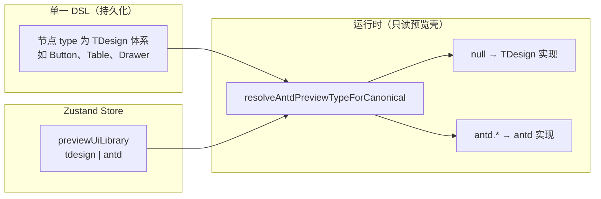
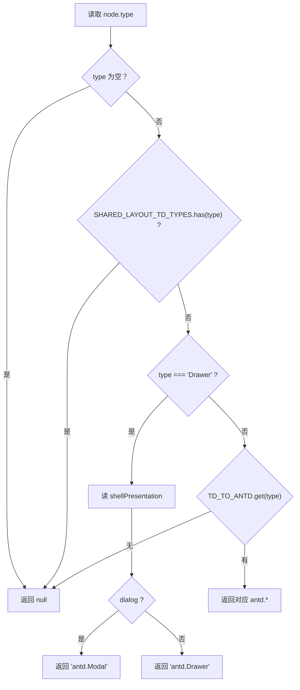

# 预览组件库（TDesign / Ant Design）详细说明

本文档描述搭建器与预览引擎中「预览组件库」的**完整现状**：设计目标、数据流、分发算法、持久化、UI 行为、扩展方式与常见误区。实现以仓库源码为准，修改分发规则或镜像表时请**同步更新本文档**与 `src/config/uiPreviewLibrary.ts` 内注释。

---

## 目录

1. [总览与术语](#1-总览与术语)  
2. [设计原则与边界](#2-设计原则与边界)  
3. [状态存储与持久化](#3-状态存储与持久化)  
4. [物料与右侧组件库面板](#4-物料与右侧组件库面板)  
5. [运行时分发算法（核心）](#5-运行时分发算法核心)  
6. [搭建画布渲染路径](#6-搭建画布渲染路径)  
7. [预览引擎渲染路径](#7-预览引擎渲染路径)  
8. [镜像表与实现覆盖的差异](#8-镜像表与实现覆盖的差异)  
9. [切换预览库：View Transitions](#9-切换预览库view-transitions)  
10. [浮层与 Portal 挂载](#10-浮层与-portal-挂载)  
11. [历史数据：antd.* 收敛](#11-历史数据antd-收敛)  
12. [扩展清单（新增一种 antd 预览物料）](#12-扩展清单新增一种-antd-预览物料)  
13. [常见问题与排错](#13-常见问题与排错)  
14. [源码索引](#14-源码索引)  

---

## 1. 总览与术语



| 术语 | 含义 |
|------|------|
| **DSL** | 页面/组件树 `UiTreeNode` 中 `type`、`props` 的约定；**不以** `antd.*` 作为持久化主形态。 |
| **预览组件库 / 预览壳** | `previewUiLibrary`：仅影响**渲染时**选用 TDesign 组件还是 antd 组件，不改变已保存的 `type` 字符串。 |
| **镜像（mirror）** | `ANTD_TD_MIRROR_PAIRS` 中一对 `tdesignType` ↔ `antdType`，表示「同一套 schema 在两种预览下的对应关系」。 |
| **强制 TDesign 集合** | `SHARED_LAYOUT_TD_TYPES`：命中后**不参与** antd 映射，始终 TDesign。 |

---

## 2. 设计原则与边界

### 2.1 目标

1. **单一事实来源**：物料定义集中在 `componentCatalog`（及 ECharts 等扩展），拖拽落库的 `type` 为 TDesign 命名空间。  
2. **可选 Ant Design 预览**：在搭建器与独立预览页中，用 antd 组件**近似还原**同一 DSL 的界面，便于对比。  
3. **可保存**：当前预览壳选择随页面/模板保存，重新打开一致。  
4. **布局稳定**：栅格、菜单、步骤条等与编辑器约束强相关的结构，**不**因切换预览壳而改用另一套布局组件，避免 DSL 与拖拽语义错位。

### 2.2 非目标

- **不**要求 antd 与 TDesign 在像素级一致。  
- **不**在 DSL 中持久化 `antd.*` 类型（历史数据除外，见第 11 节）。  
- **不**为每一个 TDesign 物料都提供 antd 预览实现；无映射的 type **回退 TDesign**。

---

## 3. 状态存储与持久化

### 3.1 Zustand Store

| 字段 | 类型 | 默认值 | 说明 |
|------|------|--------|------|
| `previewUiLibrary` | `UiPreviewLibrary` | `'tdesign'` | `createBuilderStore.ts` 初始状态 |
| `setPreviewUiLibrary` | `(library) => void` | — | 同步替换整个字段 |

### 3.2 写入路径

| 场景 | 行为 |
|------|------|
| 工具栏下拉 | `PreviewUiLibraryToolbarSelect` 调用 `runSimulatorViewTransition(() => setPreviewUiLibrary(next))`（见第 9 节） |
| 页面保存 / 导出 | `HeaderControls`、指纹等读取 `getState().previewUiLibrary` 写入模板或接口（见 `templateFingerprint.ts` 等） |
| 从服务端拉页 | `CreatePage` / `CreateComponent` 将 `pageConfig.previewUiLibrary` 规范化后灌入 store（`=== 'antd' ? 'antd' : 'tdesign'`） |

### 3.3 预览快照 `buildPreviewSnapshot`

文件：`src/builder/utils/buildPreviewSnapshot.ts`。

- 无论是否开启多路由，`pageConfig` 中均包含 **`previewUiLibrary`**。  
- 嵌入式预览、新开预览窗口与 Header 使用**同一套快照语义**，避免「编辑器里选了 antd、预览窗口仍是 tdesign」类不一致。

### 3.4 独立预览页 `PreviewEngine/index.tsx`

- 从 `snapshot.pageConfig?.previewUiLibrary` 读取；缺省按 **TDesign**。  
- 通过 `PreviewUiLibraryContext.Provider` 注入子树，供 `PreviewRenderer` 消费。

---

## 4. 物料与右侧组件库面板

### 4.1 数据来源

1. **`componentCatalog.ts`**  
   - 全量 **TDesign `type`** 的 schema（名称、默认 props、表单项等）。  
   - 是拖拽、属性面板的权威来源。

2. **`componentLibrary.ts`**  
   - **分组**（栅格、顶栏菜单、侧栏菜单、步骤条、布局等），子项引用上述 `type`。  
   - `GROUPED_COMPONENT_TYPES`：这些 `type` 在下列「平铺列表」中排除，避免重复展示。

3. **平铺列表的构建**（`ComponentLibraryPanel.tsx` 内 `libraryEntries`）  

```text
libraryEntries = presetLibraryEntriesForEntity  （来自 componentLibrary 分组）
              + plainEntries                    （来自 componentCatalog）
```

- `plainEntries`：`componentCatalog` 过滤掉 `HIDDEN_COMPONENT_TYPES`（如 `List.Item`、`Popup`）以及 **已在分组中出现的 type**（`groupedComponentTypes`），再转为 `kind: 'item'` 条目。  
- 搭建「组件实体」时会对分组做裁剪（如去掉 `RouteOutlet`）。

### 4.2 Ant Design 预览下的展示名

- 当 `previewUiLibrary === 'antd'` 时，卡片标题通过 **`antdMirrorDisplayNameByTdesignType`** 尝试显示镜像克隆条目的 `name`（来自 `buildMirroredAntdCatalogEntries`）。  
- **仅影响文案**；拖拽落库的 **schema 仍来自 TDesign 的 `componentCatalog`**，`type` 不变。

### 4.3 面板可见性：`catalogTypeMatchesPreviewLibrary`

文件：`src/config/uiPreviewLibrary.ts`。

**现状**：对 `tdesign` 与 `antd` 两种预览模式均 **`return true`**（即**不**按「是否有 antd 镜像」隐藏条目）。

**原因**：Ant Design 预览下大量节点 `resolveAntdPreviewTypeForCanonical` 为 **`null`**，仍必须用 **TDesign** 渲染（如 `BackTop`、`Calendar`、`TimePicker`）。若以前那种「仅镜像可见」的策略，会把这些物料从面板整批过滤掉，造成「组件被删了」的错觉。

---

## 5. 运行时分发算法（核心）

### 5.1 函数：`resolveAntdPreviewTypeForCanonical(node: UiTreeNode): string | null`

**文件**：`src/config/uiPreviewLibrary.ts`。

**语义**：

- 仅在「当前用户选择了 **Ant Design** 预览壳」时，由搭建器 / `PreviewRenderer` 调用；若全局仍是 TDesign 预览，不会走 antd 分支。  
- 返回 **`null`**：使用 **TDesign** 的注册表项或 `PreviewRenderer` 的 TDesign `switch`。  
- 返回 **`antd.xxx`**：使用 `antdComponents` / `tryRenderAntdPreview` 中对应实现。

### 5.2 判定顺序（必须按此顺序理解）



说明：

1. **`SHARED_LAYOUT_TD_TYPES`**  
   命中即返回 **`null`**，**不**再查镜像表。  
   因此：**镜像表里即使存在 `Grid.Row` → `antd.Row`，运行时栅格仍走 TDesign**。

2. **`Drawer`**  
   单独分支：根据 `shellPresentation` 映射为 `antd.Modal` 或 `antd.Drawer`（与「对话框 / 抽屉」共用同一 Drawer schema 的产品设计一致）。

3. **`TD_TO_ANTD`**  
   由 `ANTD_TD_MIRROR_PAIRS` 构建：`Map(tdesignType -> antdType)`。  
   **未出现在镜像表中的 TDesign `type`**（如 `BackTop`、`TimePicker`、`Calendar`、`Tabs` 等）→ **`undefined` → 返回 `null` → 全程 TDesign**。

### 5.3 `SHARED_LAYOUT_TD_TYPES` 完整列表与意图

以下类型在 **Ant Design 预览**下仍强制 **TDesign** 实现：

| type | 设计意图（摘要） |
|------|------------------|
| `Grid.Row`, `Grid.Col` | 与编辑器栅格、响应式 DSL 一致；不切换为 antd Row/Col。 |
| `Layout` 及 `Layout.Header/Content/Aside/Footer` | 布局区域与壳结构稳定。 |
| `Flex`, `Flex.Item`, `Stack`, `Inline` | 搭建器布局抽象。 |
| `Space` | 与镜像表中 `antd.Space` 并存时，**运行时以本集合优先**，强制 TDesign `Space`。 |
| `RouteOutlet`, `ComponentSlotOutlet` | 路由与插槽语义。 |
| `HeadMenu`, `Menu`, `Menu.Submenu`, `Menu.Item`, `Menu.Group` | 菜单层级与拖拽约束。 |
| `Steps`, `Steps.Item` | 步骤条结构；**不**走 antd Steps。 |

### 5.4 `ANTD_TD_MIRROR_PAIRS` 完整表（数据源）

**文件**：`src/config/antdCatalogMirror.ts`（以源码为准；下表为说明用）。

| TDesign `tdesignType` | antd `antdType` | 备注 |
|------------------------|-----------------|------|
| Divider | antd.Divider | |
| Typography.Title | antd.Typography.Title | |
| Typography.Paragraph | antd.Typography.Paragraph | |
| Typography.Text | antd.Typography.Text | |
| Link | antd.Typography.Link | |
| Button | antd.Button | |
| Icon | antd.Icon | |
| Card | antd.Card | |
| Statistic | antd.Statistic | |
| Input | antd.Input | |
| Textarea | antd.Textarea | |
| InputNumber | antd.InputNumber | |
| Switch | antd.Switch | |
| Space | antd.Space | 与 `SHARED_LAYOUT_TD_TYPES` 中的 `Space` **冲突时，运行时以 SHARED 为准 → 实际仍为 TDesign Space** |
| Grid.Row | antd.Row | **运行时若 type 为 Grid.Row，先被 SHARED 拦截 → 不映射** |
| Grid.Col | antd.Col | 同上 |
| Layout 系列 | antd.Layout.* | **运行时先被 SHARED 拦截** |
| Table | antd.Table | |
| List | antd.List | |
| Drawer | antd.Drawer / antd.Modal | Drawer 走第 5.2 节单独逻辑；镜像用于克隆条目 |
| Menu / Menu.Item / Menu.Submenu | antd.Menu 等 | **运行时先被 SHARED 拦截** |

> **重要**：镜像表用于 **buildMirroredAntdCatalogEntries**、历史迁移、以及 **TD_TO_ANTD** 的「理论映射」。**真正运行时**还要经过 **`SHARED_LAYOUT_TD_TYPES`** 过滤；上表中凡与 SHARED 重叠的项，**实际 antd 映射不会生效**。

---

## 6. 搭建画布渲染路径

### 6.1 `CommonComponent`

文件：`src/builder/renderer/CommonComponent.tsx`。

1. **`previewUiLibrary`**  
   - 默认：`useStore(s => s.previewUiLibrary)`  
   - 可被 **`SimulatorPreviewLibraryOverrideContext`** 覆盖（历史上用于双栈刷场；当前过渡方案为 View Transitions，上下文仍保留为单值包裹）。

2. **`registryLookupType` 计算**  

```text
若 previewUiLibrary !== 'antd'  → 使用 normalizedType（TDesign type）
若 previewUiLibrary === 'antd'     → resolveAntdPreviewTypeForCanonical(data) ?? normalizedType
```

- 解析结果为 **`null`** 时，`??` 回退为 **`normalizedType`**，即 **TDesign 的 registry 键**（如 `Button`、`Steps`）。  
- 解析结果为 **`antd.xxx`** 时，从 `registry` 取 `antdComponents` 注册的实现。

3. **查表**：`registry.get(registryLookupType)`；无则返回 `null`。

### 6.2 搭建器 antd 注册表

**文件**：`src/builder/renderer/registries/antdComponents.tsx`。

- 为搭建态提供简化/占位实现（部分与预览页 `previewAntdNodes` 能力不完全一致，属预期）。  
- 与 `resolveAntdPreviewTypeForCanonical` 可能返回的键需**可解析**，否则画布空白。

---

## 7. 预览引擎渲染路径

### 7.1 `PreviewRenderer`

文件：`src/pages/PreviewEngine/components/PreviewRenderer.tsx`。

1. 从 **`PreviewUiLibraryContext`** 读取 `previewUiLibrary`（独立预览页由 `PreviewEngine/index.tsx` 注入；嵌入式由 `BuilderEmbeddedPreview` 注入）。  
2. 若 **`previewUiLibrary === 'antd'`**：  
   - 先算 `antdPreviewType = resolveAntdPreviewTypeForCanonical(node)`；  
   - 若 **非空**，调用 **`tryRenderAntdPreview`**（`previewAntdNodes.tsx`）；  
   - 若返回元素则 **直接 return**；  
   - 否则落入下方 **`switch (type)`** 的 **TDesign 分支**（同一文件内大量 `tdesign-react` 组件）。  
3. 若 **`previewUiLibrary !== 'antd'`**：跳过 antd，直接走 TDesign `switch`。

### 7.2 `tryRenderAntdPreview` 与 Portal

- 入参包含 **`getPortalContainer`**（来自 `PreviewPortalContainerContext` 或默认 `document.body`），保证 **Drawer / Modal** 等挂载在模拟器滚动容器内，而不是整页 `body`（嵌入式预览尤其重要）。

---

## 8. 镜像表与实现覆盖的差异

- **`ANTD_TD_MIRROR_PAIRS`**：决定 **`resolveAntdPreviewTypeForCanonical`** 能返回哪些 **`antd.*`**（在未被 SHARED 拦截的前提下）。  
- **`previewAntdNodes.tsx`**：存在**多于**镜像表的 `case 'antd.xxx'`（如 `antd.Tag`、`antd.Badge` 等），用于 **tryRenderAntdPreview** 内部分支；若 DSL 的 **canonical type** 从未映射到这些 `antd.*`，则这些分支可能**不会**从 `resolve` 进入，属「预留或历史」代码路径。  
- **搭建器 `antdComponents.tsx`**：同样存在与镜像**不对齐**的注册键时，需单独排查是否可达。

扩展时建议：**以镜像表 + resolve 逻辑为准**，保证「面板 → 分发 → 渲染」闭环，再补全 `previewAntdNodes` / `antdComponents`。

---

## 9. 切换预览库：View Transitions

**文件**：`src/builder/utils/simulatorViewTransition.ts`。

- 使用 **`document.startViewTransition`**，在回调内 **`flushSync(() => setPreviewUiLibrary(next))`**，由浏览器对带 **`view-transition-name`** 的快照做 GPU 过渡。  
- **不再**在切换时挂载两套 React 画布（旧双实例方案已移除）。  
- **样式**：`SimulatorLibraryBrushOverlay.less` 中为 **`urpbuilder-sim-main`**（主画布）与 **`urpbuilder-sim-embedded`**（嵌入式预览）分别定义 `::view-transition-old/new`，避免同名冲突。  
- **`prefers-reduced-motion: reduce`**：跳过 View Transition，仅 `flushSync` 更新，避免过渡动画。

---

## 10. 浮层与 Portal 挂载

| 机制 | 作用 |
|------|------|
| **`SimulatorScrollContainerContext`** | 在 `ComponentBody` 的 `.simulator-scroll` 上挂 ref + 回调；`getBuilderDrawerAttach` / `getSimulatorMountEl` 返回**当前主模拟器** DOM。 |
| **`SimulatorLibraryBrushOverlay`** | 包裹模拟器内容，提供 **`view-transition-name`** 外壳与 **`SimulatorPreviewLibraryOverrideContext`**（与 store 同步的 `activeLibrary`）。 |
| **`PreviewPortalContainerContext`** | 嵌入式预览中包住 `PreviewRenderer`，使 TDesign `Drawer`/`Dialog`/`Popup` 的 **`attach`** 与 antd 的 **`getContainer`** 指向**嵌入式**滚动容器，而非主窗口第一个 `[data-builder-scroll-container]`。 |

---

## 11. 历史数据：antd.* 收敛

**文件**：`src/builder/utils/normalizeUiTreeLegacyAntd.ts`。

- 若历史 JSON 中节点 **`type` 以 `antd.` 开头**：  
  - 若在 **`ANTD_TD_MIRROR_PAIRS`** 中有对：改写为对应 **`tdesignType`**，并必要时补 `shellPresentation` 等；  
  - 若无对：替换为占位 **`Typography.Paragraph`**，提示用户用 TDesign 物料重建。  

加载页面/模板后通常会对树做一次规范化，保证 **单一 DSL**。

---

## 12. 扩展清单（新增一种 antd 预览物料）

按顺序检查：

1. **`ANTD_TD_MIRROR_PAIRS`**  
   增加 `antdType` / `tdesignType`（及可选 `name`）。  
2. **`SHARED_LAYOUT_TD_TYPES`**  
   若该 TDesign 类型应**永远**不切 antd：把 `tdesignType` 加入此集合（或**不要**把它放进镜像表）。  
3. **`resolveAntdPreviewTypeForCanonical`**  
   一般无需改：**自动**由镜像表 + SHARED + Drawer 规则推导；仅在特殊 prop 规则时追加分支。  
4. **`previewAntdNodes.tsx`**  
   为新的 `antd.*` 增加 `case` 与属性桥接。  
5. **`antdComponents.tsx`**  
   为搭建器增加 `registry.set('antd.xxx', ...)`。  
6. **自测**  
   - TDesign 预览：行为与改造前一致；  
   - Ant Design 预览：新物料走 antd；  
   - 右侧面板：两种模式下均可见（第 4.3 节）。

---

## 13. 常见问题与排错

| 现象 | 可能原因 | 建议 |
|------|----------|------|
| Ant Design 预览下缺少某物料 | 曾用过滤隐藏无镜像物料 | 现 `catalogTypeMatchesPreviewLibrary` 已全量；若仍无，查 `HIDDEN_COMPONENT_TYPES` / 分组去重 |
| 栅格仍是 TDesign 外观 | **预期** | `Grid.Row/Col` 在 `SHARED_LAYOUT_TD_TYPES` |
| 步骤条仍是 TDesign | **预期** | `Steps` 在 SHARED |
| 选了 antd 但 Button 仍像 TDesign | `previewUiLibrary` 未进 Context 或未保存 | 查 store、`buildPreviewSnapshot`、独立预览页 Provider |
| 抽屉跑到主窗口外 | Portal 未指向模拟器 | 查 `SimulatorScrollContainerContext`、`PreviewPortalContainerContext` |
| 镜像表有 antd.Row 但无效 | SHARED 优先 | 见第 5.4 节 |

---

## 14. 源码索引

| 主题 | 路径 |
|------|------|
| 预览库类型、分发、面板过滤 | `src/config/uiPreviewLibrary.ts` |
| antd/TDesign 镜像表与克隆 | `src/config/antdCatalogMirror.ts` |
| 物料定义 | `src/config/componentCatalog.ts` |
| 组件库分组 | `src/config/componentLibrary.ts` |
| 右侧面板逻辑 | `src/builder/components/ComponentLibraryPanel.tsx` |
| 工具栏切换 + View Transition | `src/builder/components/PreviewUiLibraryToolbarSelect.tsx`、`src/builder/utils/simulatorViewTransition.ts` |
| 模拟器外壳与 VT 样式 | `src/builder/components/SimulatorLibraryBrushOverlay.tsx`、`.less` |
| Store 默认值与 setter | `src/builder/store/createBuilderStore.ts`、`types.ts` |
| 快照 | `src/builder/utils/buildPreviewSnapshot.ts`、`src/pages/PreviewEngine/utils/snapshot.ts` |
| 搭建分发 | `src/builder/renderer/CommonComponent.tsx` |
| 搭建 antd 注册表 | `src/builder/renderer/registries/antdComponents.tsx` |
| 预览 antd 节点 | `src/pages/PreviewEngine/components/previewAntdNodes.tsx` |
| 预览 TDesign 大 switch | `src/pages/PreviewEngine/components/PreviewRenderer.tsx` |
| 独立预览入口 | `src/pages/PreviewEngine/index.tsx` |
| 嵌入式预览 | `src/builder/components/BuilderEmbeddedPreview.tsx` |
| 历史 antd 收敛 | `src/builder/utils/normalizeUiTreeLegacyAntd.ts` |
| Portal 上下文 | `src/pages/PreviewEngine/context/PreviewPortalContainerContext.tsx` |
| 模拟器滚动挂载 | `src/builder/context/SimulatorScrollContainerContext.tsx` |

---

**文档维护**：修改 `SHARED_LAYOUT_TD_TYPES`、`ANTD_TD_MIRROR_PAIRS` 或分发函数时，请更新 **第 5、8、12 节** 及镜像表小节。
